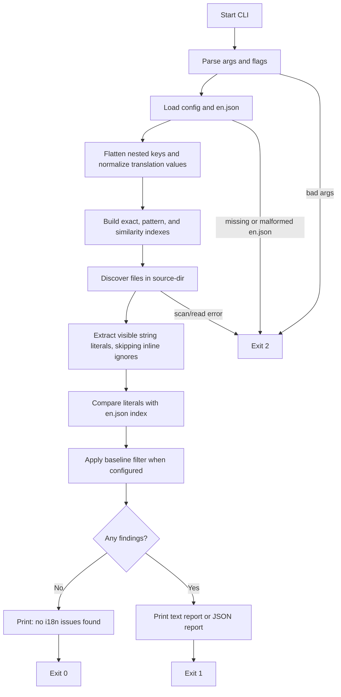
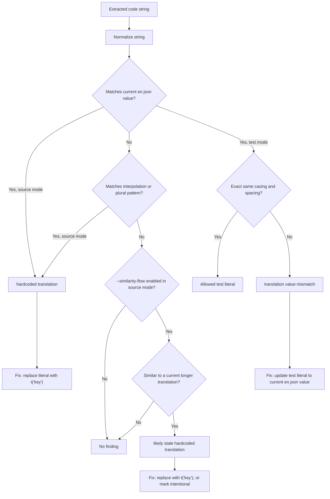
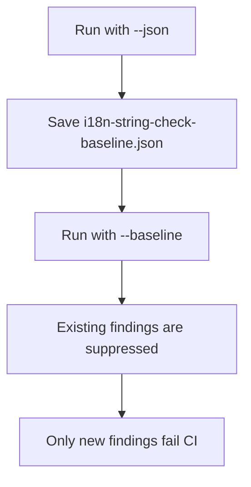

# i18n-string-check Flow

`i18n-string-check` compares strings found in code against the current values in `en.json`.

It does not rewrite code. It reports places where a string should probably use a translation key, where a test literal drifted from `en.json`, or where source code looks like it still contains an older version of a changed translation.

## Inputs

```sh
i18n-string-check <path-to-en.json> <source-dir> [flags]
```

```text
<path-to-en.json>  JSON file with flat or nested translation strings
<source-dir>       directory to scan for source or test files
```

## Main Flow



## Mode Decision Flow



## What Each Finding Means

| Finding | When it appears | Typical fix |
| --- | --- | --- |
| `hardcoded translation` | Source code contains a string that matches a current `en.json` value. | Replace the literal with `t("key")` or the project's i18n helper. |
| `hardcoded translation` | Source code contains a string that matches a current interpolation or plural translation pattern. | Replace the literal with `t("key")` or the project's i18n helper. |
| `translation value mismatch` | `--mode=test` finds a test literal that normalizes to an `en.json` value but differs in exact casing or spacing. | Update the test literal to the current `en.json` value. |
| `likely stale hardcoded translation` | `--similarity-flow` finds source code with a longer string similar to a current `en.json` value. | Replace with the matching translation key, or mark the literal intentional. |

## Flags

| Flag | Default | Applies to | What it does |
| --- | --- | --- | --- |
| `--mode=source\|test` | `source` | Matching | Chooses whether to scan source code for hardcoded translations or tests for value drift. |
| `--min-length=N` | `8` | `en.json` indexing and code extraction | Ignores strings shorter than `N` after trimming. |
| `--ext=ts,tsx,js,jsx` | `ts,tsx,js,jsx` | File discovery | Chooses which file extensions to scan. Dots are optional, so `--ext=.ts,.tsx` also works. |
| `--exclude=pattern` | Built-in excludes plus none from CLI | File discovery | Skips files or directories. Can be passed multiple times. |
| `--config=path` | `.i18n-string-check.json` when present | Config | Loads defaults for flags such as `minLength`, `ext`, `exclude`, `mode`, `similarityFlow`, `json`, and `baseline`. CLI flags override config values. |
| `--baseline=path` | none | Reporting | Suppresses findings already present in a previous `--json` report. |
| `--json` | `false` | Reporting | Prints machine-readable JSON instead of text. |
| `--similarity-flow` | `false` | Source-mode matching | Enables conservative matching for likely stale longer translation strings. |

## Inline Ignore

Use `i18n-string-check-ignore` on the same line or previous line to mark an intentional literal:

```ts
// i18n-string-check-ignore
const productName = "i18n-string-check";
```

## Baseline Flow



## Pattern Matching

Interpolation and plural values become anchored translation patterns:

```json
{
  "profile.greeting": "Hello, {name}",
  "cart.item_other": "{count} items",
  "invite": "{count, plural, one {# invite} other {# invites}}"
}
```

These can flag hardcoded strings such as:

```text
Hello, Bob
2 items
3 invites
```

Built-in excluded paths:

```text
node_modules
.git
dist
build
coverage
.next
playwright-report
test-results
```

## Similarity Flow

`--similarity-flow` is intentionally conservative. It only runs when:

- the checker is in `source` mode
- exact matching found no current `en.json` value for the code string
- both strings are longer multi-word strings

It can catch this:

```json
{
  "login.title": "Hello my name is Justas, And I am Human, I am QA too"
}
```

```tsx
<h1>Hello my name is Justas, And I am Human</h1>
```

It should avoid short or weak matches like:

```text
Sign in using MP
Sign in using biometrics
```

## Exit Codes

| Code | Meaning |
| --- | --- |
| `0` | No i18n issues found. |
| `1` | One or more findings were reported. |
| `2` | Bad arguments, IO error, parse error, or malformed `en.json`. |
